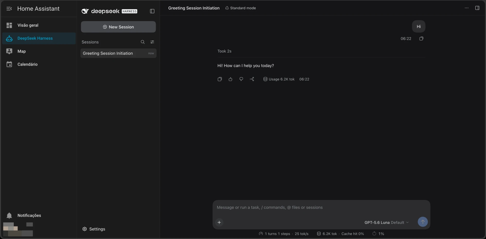

<p align="center">
  
</p>

<h1 align="center">DeepSeek Harness for Home Assistant</h1>

<p align="center">
  <a href="https://github.com/edgarfroes/dsh-ha-ingress-auth/actions/workflows/ci.yaml"></a>
</p>

Chat with AI models right from your Home Assistant sidebar, with a private
space for everyone at home.

This app puts [DeepSeek Harness](https://github.com/deepseek-ai/deepseek-harness)
inside Home Assistant and uses the accounts you already have there. Nobody
needs a new login.

- **Everyone gets their own chats.** Each person's conversations are theirs
  alone.
- **Admins set things up once.** A Home Assistant administrator adds the AI
  models and API keys, and everyone can use them.
- **Everyone else just chats.** Other users get a simple chat list and only
  the settings that are about them: language, theme, font size, and what
  Enter does while a reply is still coming.

This is what a family member sees:



To install it, add [hassio-apps](https://github.com/edgarfroes/hassio-apps) to
Home Assistant. It has step-by-step screenshots. The rest of this page is for
people who want to know how it works or help build it. User documentation
lives in [DOCS.md](app/dsh_ha_ingress_auth/DOCS.md).

## Install (Home Assistant)

Add the app repository **https://github.com/edgarfroes/hassio-apps** in Home
Assistant (**Settings → Apps → Install app → ⋮ → Repositories → Add**), install
**DeepSeek Harness**, start it and turn on **Show in sidebar**. Step-by-step
screenshots: [edgarfroes/hassio-apps](https://github.com/edgarfroes/hassio-apps).
The app runs the prebuilt image `ghcr.io/edgarfroes/dsh-ha-ingress-auth`
(amd64 and aarch64).

To build it on the device from a checkout instead, copy
`app/dsh_ha_ingress_auth/` into Home Assistant's `/addons` folder as a local
app, remove its `image:` line and run `npm ci && npm run app:context` first:
Home Assistant builds an app from its own folder only.

## Layout

```
src/plugin/host.js        dsh host plugin loaded into every per-user process
src/gateway/              the ingress gateway (Node, no framework)
  cli.js                    entry point of the app
  server.js                 identity, role, forwarding
  roles.js                  HA users over Core's WebSocket (config/auth/list)
  children.js               one dsh process per user (uid, env, lifecycle)
  shared-config.js          admin settings shared across processes
  overlays.js               the --patch overlay each process boots with
  proxy.js                  HTTP/WebSocket forwarding and request policy
app/dsh_ha_ingress_auth/  the Home Assistant app (config.yaml, Dockerfile, DOCS.md)
e2e/                      fake-ingress stack (compose) + Playwright suite
test/unit/                node:test unit tests
```

## Design

| Need | How |
|---|---|
| Who is this? | Supervisor sets `X-Remote-User-Id` on ingress requests and drops any copy the browser sends. The gateway trusts it only on connections from Supervisor's ingress address (`172.30.32.2`). |
| Admin or not? | Core's `config/auth/list` over `ws://supervisor/core/websocket` (`homeassistant_api: true`). Admin = member of `system-admin`; user = `system-users`; anyone else is refused. |
| Private chats | Each user gets their own `dsh web` (own `DSH_HOME`, working directory and Unix uid) bound to `127.0.0.1`. dsh has a single operator per process, so a process per user is the separation. |
| Browser credentials | The gateway follows the child's launch URL (`connection.authenticatedUrl()`, written by the host plugin) and keeps the dsh cookie server-side. The browser only ever holds Home Assistant's own session. |
| Admin-only screens | The non-admin overlay disables the rows that provide them (`disabled: true`, the mechanism dsh's own bundle uses): Models, Plugins, Permission, plugin manager, terminal, file preview, folder picker. The Agent presets section (shipped with the preset picker users keep) and the General rows Work details, Performance & usage and Developer tools (shipped with chat) are hidden for users by index `style` rows; Developer tools is also forced off in their overlay. Users' session list starts as "In one list" (an index `script` row seeds dsh's browser-local view once). |
| Shared admin settings | dsh saves Settings into the process's profile patch. The gateway copies admin rows between admins (holding dsh's own profile writer lock) and writes them as the non-admin processes' home patch, which dsh ranks above the profile patch and refuses to override. |
| Per-user preferences | Rows `ui-theme`, `locale`, `ui-chat`, `ui-conversation`, `ui-settings-general`, `ui-settings` stay in each user's own profile patch. |
| API keys for users | Passed as environment to user processes (dsh's environment credential layer, read-only in the UI). Users get no shell or file tools (`ctx.tools.guard` allow-list), no terminal, and `api/file` is limited to their own folder. |
| Settings behind a proxy | dsh disables Settings persistence on non-loopback pages. The host plugin sets `__DSH_TRANSPORT__.ownsHost` through an index `global` row. **This field is documented as shell-only**: it is the one deviation, tracked upstream in deepseek-harness discussion #5829. |
| HA ingress query re-encoding | Supervisor/Core forward queries as parsed parameters; dsh's combined plugin URLs (`plugins/??a,b`) come back as `??a,b=`. The gateway restores them. |

## Develop

```sh
npm ci
npm test          # unit tests
npm run e2e       # builds the app image and runs the fake-ingress suite in Docker
```

The E2E stack (`e2e/compose.yaml`) puts the real app image behind a stand-in
for Supervisor ingress at `172.30.32.2`, with a synthetic Home Assistant user
list and a stub OpenAI-compatible model, so it spends no tokens and needs no
Home Assistant.

## Release

1. Bump `version:` in `app/dsh_ha_ingress_auth/config.yaml`.
2. Commit, tag `v<version>` and push the tag. `.github/workflows/release.yaml`
   builds both architectures with Home Assistant's builder and publishes the
   images to ghcr.io.
3. First release only: make the `dsh-ha-ingress-auth` package public in GitHub
   → Packages → Package settings, so Home Assistant can pull it anonymously.
4. In [hassio-apps](https://github.com/edgarfroes/hassio-apps), set the same
   `version:` in `dsh_ha_ingress_auth/config.yaml` and add a `CHANGELOG.md`
   entry. Home Assistant offers the update from there.

## Versions

- `@deepseek-ai/dsh` **0.1.7-alpha.2**, exact, via
  `app/dsh_ha_ingress_auth/runtime/package-lock.json`. 0.1.7-alpha.1 is the
  first dsh that can be served under an ingress sub-path.
- `@earendil-works/pi-ai` **0.87.1** through npm `overrides` (dsh pins
  `^0.85.1`). pi-ai 0.86+ sends the `x-opencode-session` header OpenCode Go and
  Zen require; without it every opencode request fails with `MissingSessionID`.
  Remove the override once dsh depends on pi-ai ≥ 0.86.
- Base image `node:22.23.2-bookworm-slim`, pinned by digest.

## License

MIT
